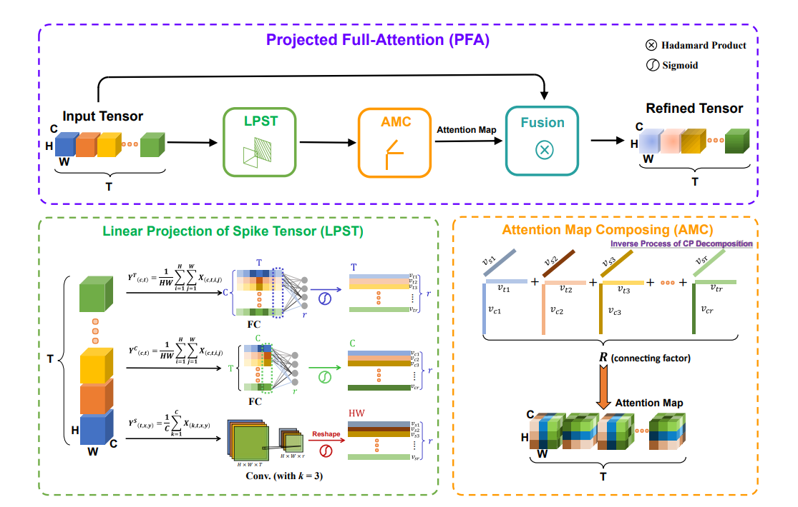

# Tensor Decomposition Based Attention Module for Spiking Neural Networks





This is the official repository for paper *Tensor Decomposition Based Attention Module for Spiking Neural Networks* 

[pdf](https://arxiv.org/pdf/2310.14576.pdf)


## How to Run

### 1. Prepare environment

#### 1) Docker file
A docker file is provided in `env` directory. You can build the docker image and run the container with the following commands:

```bash
docker build -t pfa ./env
```

#### 2) Docker image
coming soon

#### 3) pip
Use the following command to setup environment with pip:

```bash
pip install -r requirements.txt
```
<font color="red">NOTE: If your cuda version is above 12.0, you may modify cupy-cuda11x in requirements.txt to cupy-cuda12x</font>

## 2.Run the code
Modify main.py according to your needs and run:
```bash
python main.py
```
